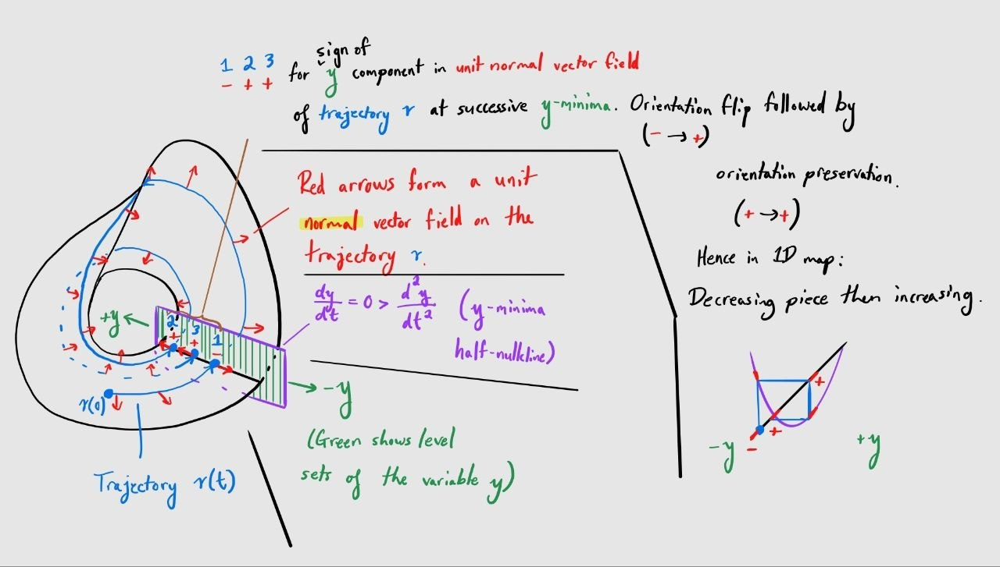
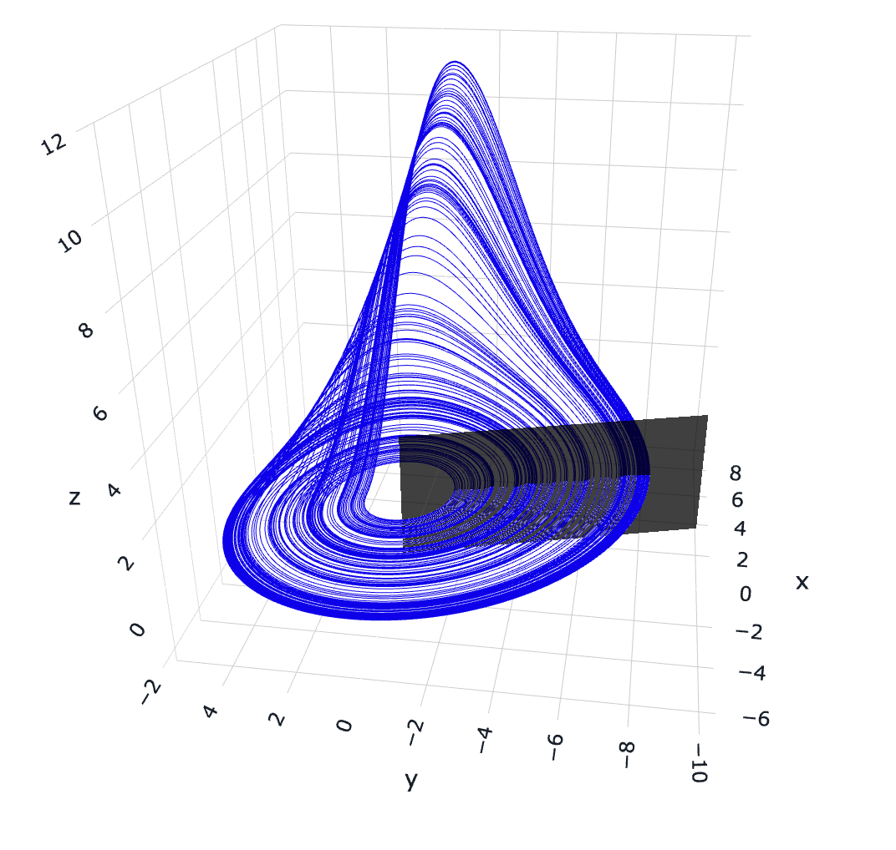
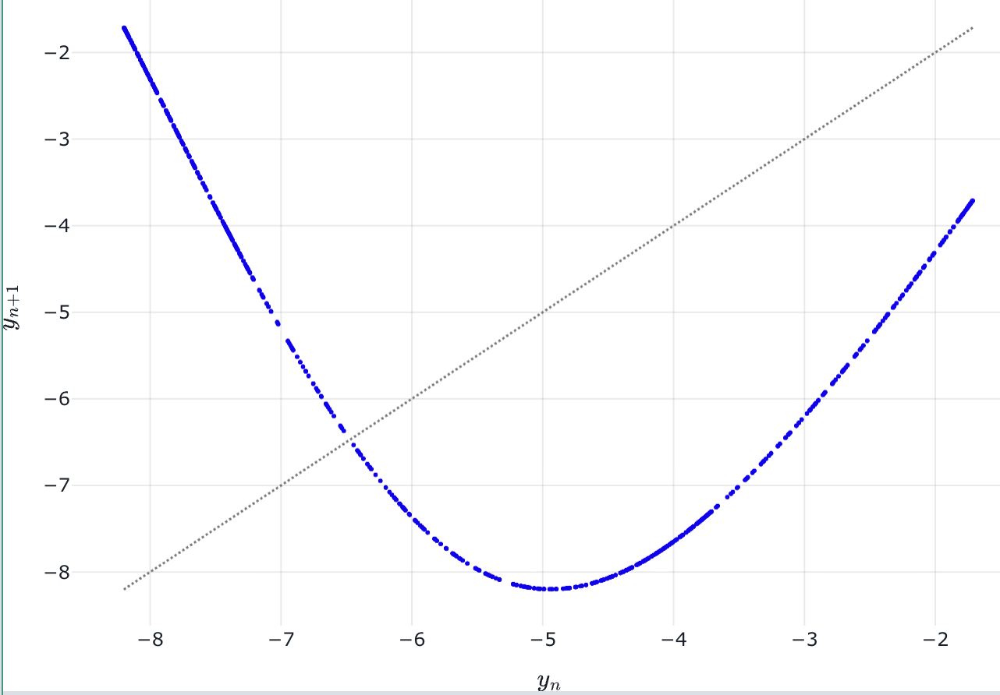
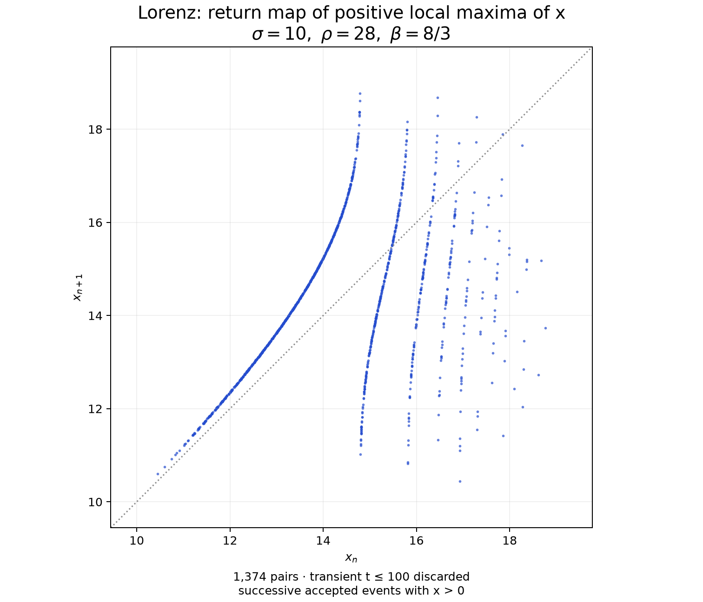
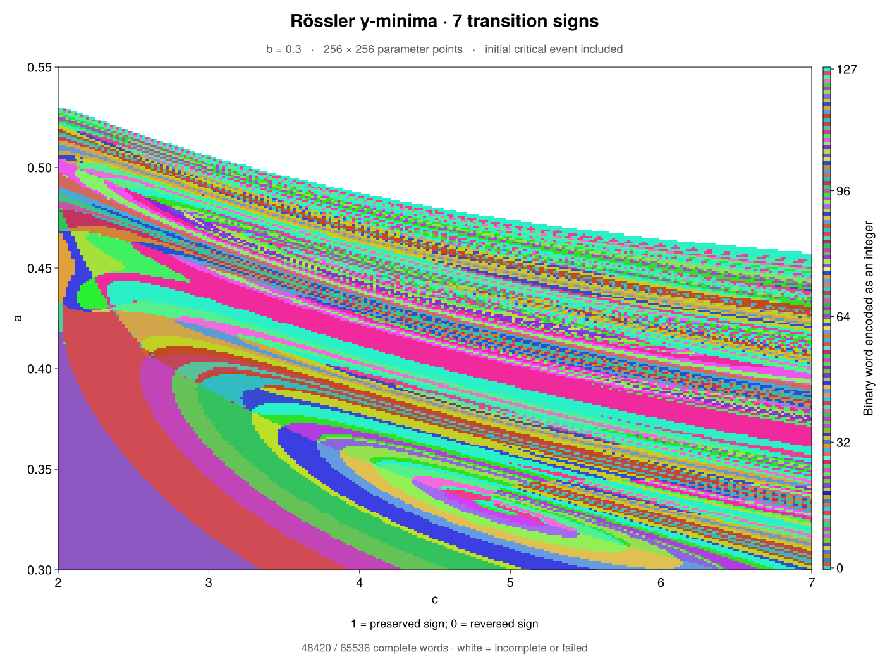

# [Flow kneading](@id flow-kneading)

Kneading.jl is capable not only of calculating kneading invariants and producing kneading diagrams for true one-dimensional maps, but it can also produce kneading diagrams for flows in systems of ordinary differential equations with chaotic attractors of fractal dimension close to two.
This technique is closely related to the methods described by [Barrio, Shilnikov, and Shilnikov (2012)](https://doi.org/10.1142/S0218127412300169) and [Malykh et al. (2020)](https://doi.org/10.1063/5.0026188), but has been modified to accommodate ODE systems exhibiting approximately one-dimensional return maps resembling multimodal maps.

The method used by Kneading.jl is described in a forthcoming paper by this repository's developer.
The presentation slides from a talk on the method given at the 2026 International Workshop on Dynamical Systems can be found at [this Google Drive link](https://drive.google.com/file/d/1_dOI3qKMyxFs_G0LgptGqY2s1UisPupQ/view?usp=drive_link).

The updated flow-kneading method used by Kneading.jl is inspired by the idea that decreasing portions of the one-dimensional return map of a chaotic attractor in a flow correspond to an odd number of half-twists and the increasing portions to an even number in the corresponding topological template, and hence (informally speaking, to paint a mental picture only) a smooth unit vector field in the unstable real line bundle over the template will "flip direction" when the return of an orbit lands in a decreasing portion and will "maintain direction" when the return lands in an increasing portion.
There is probably a much better way to convey this idea, but without some pictures it is difficult to explain.

The flow-kneading functionality in Kneading.jl comprises the following features:

- *Integration of flow-normal tangent vectors*, meant to track the unstable direction "along" the attractor that is orthogonal to the flow.
- Orbit and flow-normal tangent vector initialization routines
  - Newton iteration and leading-stable-direction initialization for flow-normal tangent vectors at a *real hyperbolic saddle equilibrium with a single positive characteristic eigenvalue*
  - Initialization and continuation of smooth Rössler-like critical points by anchoring to a *saddle-focus equilibrium with two-dimensional spiral unstable manifold*

For a first calculation, start with the [Lorenz usage example](#Usage-example)
or the [Rössler example](#Rössler-example). Both use an autonomous
`CoupledODEs` system. Kneading.jl computes the derivatives automatically;
the ODE rule must support ForwardDiff's numeric types, as the examples do.

# Overview
Flow kneading involves studying discrete events that occur on a unit normal vector field over a trajectory curve.
The library handles four stages:

1. **Initialization:** Selecting a distinguished, or "critical", trajectory and initializing a flow-normal tangent vector at its initial condition.
2. **Integration:** Solving the critical trajectory and transporting the flow-normal tangent vector along it.
3. **Event capture:** Determining some condition which must be met by the critical trajectory to trigger a discrete "event", where some information will be recorded about the dynamics.
4. **Encoding:** Recording some information about the flow-normal tangent vector at the time of a discrete event.

The sketch below hopefully gives some sense of how the overall procedure works, based on what is going on geometric when we compute flow kneading for the Rössler attractor.
Hopefully staring at it for a while makes it make sense.
It's not meant to be read in any particular order.
If it's important to anyone, I can clean this sketch up and make it easier to understand.



## Background

Take a system specified via `DynamicalSystem` and `TangentDynamicalSystem` in $\mathbb{R}^N$ for some $n \geq 3$ as a flow governed by an autonomous ODE system:
$$\dot{\mathbf{x}} = \mathbf{f}(\mathbf{x}), \qquad \mathbf{x} \in \mathbb{R}^N,$$
$$\dot{\vec{v}} = D\mathbf{f}\vec{v}, \qquad \vec{v}(t) \in T_{\mathbf{x}(t)}\mathbb{R}^N.$$

The vector field $\vec{v}(t)$ is supposed to track the unstable direction along the roughly-two-dimensional attractor (orthogonal to the flow direction) at each solved point along the trajectory $\mathbf{x}(t)$.

## Initialization
The initial condition is technically the tangent vector $\vec{v}(0) \in T_{\mathbf{x}(0)}\mathbb{R}^N$, but we need to keep track of $\mathbf{x}(0)$ separately since in Julia each is just a vector of floating-point numbers.
Flow kneading requires a particular initial condition to be chosen; since partition points of one-dimensional return maps for flows typically correspond to some initial condition in the unstable manifold of some kind of hyperbolic saddle equilibrium, we provide two initialization methods that return $\mathbf{x}(0)$ and $\vec{v}(0)$ given an initial guess for the location of such an equilibrium in the state space $\mathbb{R}^N$:

- **Real-saddle initialization:** `init_real_saddle` finds the equilibrium by
  Newton iteration, verifies that it has one real unstable direction, launches
  $\mathbf{x}(0)$ along a chosen branch of that direction, and constructs
  $\vec{v}(0)$ from the leading (i.e., weakest) stable direction by projecting it normal to the
  flow and normalizing it.
- **Saddle-focus initialization:** `init_saddle_focus` selects a local seed
  ray from the intersection of the two-dimensional unstable spiral eigenspace
  with the tangent plane to a chosen extremum section. It integrates candidate
  seeds to successive extrema, solves for a critical point of the induced
  return map, and continues that point in a parameter using event-corrected
  sensitivities.

## Integration
Any `TangentDynamicalSystem`-based integrator can be used.
The flow-normal tangent vector $\vec{v}(t)$ is integrated according to the tangent dynamics $\dot{\vec{v}} = D\mathbf{f}(\mathbf{x}(t))\vec{v}$, but each integration step (or every few integration steps) $\vec{v}$ is projected onto the orthogonal subspace of the flow direction:
$$\vec{v} \leftarrow \vec{v} - \mathrm{proj}_{\mathbf{f}(\mathbf{x})} \vec{v}.$$
The projected vector is then normalized:
$$\vec{v} \leftarrow \frac{\vec{v}}{\|\vec{v}\|}.$$
If this orthogonalization step is omitted, $\vec{v}$ can pass through the flow direction and wind up pointing the other way along the attractor (switching sign) without the attractor doing a half-twist.

## Event capture

Along a critical trajectory, we monitor for some *event* condition to be met, at which time we record some data about the flow-normal tangent vector $\vec{v}$ in order to generate a new symbol encoding the dynamical behavior of the critical trajectory.
The usual event condition is a local extremum in a state variable; for instance, the Lorenz system has state $(x(t), y(t), z(t)) \in \mathbb{R}^3$ so we might monitor for local maxima in $z(t)$ using the condition
$$\ddot{z} < 0 = \dot{z}.$$
For local minima in $x(t)$, for example, we would use the condition
$$\dot{x} = 0 < \ddot{x}.$$

Since events are determined by zero-crossings of a test function like $\dot{x}(t)$ at successive sample times $t = t_n$ and $t_{n+1}$ (e.g., with Euler's method, $t_n$ and $t_{n+1} = t_n + \Delta t$), Kneading.jl is able to approximate the true time $\tau$ of the event by linear interpolation based on the values of $\dot{x}(t)$ at the two nearest sampled times:
$$\tau \approx t_n - \dot{x}(t_n)\frac{t_{n+1}-t_n}{\dot{x}(t_{n+1})-\dot{x}(t_n)}.$$

This interpolation is used by the fixed-step `integration = :rk4` option.
The default adaptive solver instead locates each zero using continuous
interpolation and root finding. Use `LocalMaximum(i)` or `LocalMinimum(i)`
to select the event, where `i` is the state-variable index.

### Encoding

At each captured event (say, at time $t = t_n$), we have access to two data: $\mathbf{x}(t_n) \in \mathbb{R}^N$ and $\vec{v}(t_n) \in T_{\mathbf{x}(t_n)}\mathbb{R}^N$.
If the event condition is a local extremum in the state variable $z$, then we can record the sign of the $z$ component of the vector $\vec{v}(t_n)$:
$$s_n = \mathrm{sign} \left\langle \frac{\partial}{\partial z}, \vec{v}(t_n) \right\rangle.$$
Then we obtain a sequence $(s_1, s_2, s_3, \ldots)$ of symbols $\pm 1$, in some sense telling us about the unstable direction $\vec{v}(t)$ along the trajectory $\mathbf{x}(t)$.
Detecting changes in this symbolic sequence as the system parameters are varied produces a kneading diagram.

!!! note
    It is not strictly necessary to use the same state variable for the event condition and for the flow-normal tangent vector component used to produce the symbolic sequence.
    You can use any variable's extrema for the event condition and simultaneously use any component's sign for the flow-normal tangent vector to obtain symbols.

## Usage example

This example follows a critical trajectory of the Lorenz system, captures local maxima of
$z$, and records the sign of the transported tangent's $z$ component at each maximum.

```julia
using DynamicalSystemsBase
using Kneading

function lorenz_rule!(du, u, p, t)
    x, y, z = u
    σ, ρ, β = p

    du[1] = σ * (y - x)
    du[2] = x * (ρ - z) - y
    du[3] = x * y - β * z
    return nothing
end

parameters = [10.0, 28.0, 8 / 3]
equilibrium_guess = [0.0, 0.0, 0.0]
lorenz = CoupledODEs(lorenz_rule!, equilibrium_guess, parameters)

initializer = RealSaddleInitializer(
    equilibrium_guess = equilibrium_guess,
    launch_distance = 1e-6,
    unstable_branch = 1,
)

z_index = 3

problem = FlowKneadingProblem(
    lorenz;
    initializer = initializer,
    capture = LocalMaximum(z_index),
    observable = CoordinateComponent(z_index),
    word_length = 16,
    maximum_time = 1_000.0,
)

result = flow_kneading(problem)
lap_orientations = result.transition_word
```

The initializer displaces the orbit from the equilibrium before integration;
starting exactly at the equilibrium would leave it stationary.
The returned word describes orientation **between successive events**:
if the sampled component signs are $s_n$, then $m_n=s_n s_{n+1}$ is $+1$
for preservation and $-1$ for reversal. Thus 16 transition symbols require
17 captured signs. These are the symbols to compare when tracing contours;
raw component signs accumulate earlier reversals.

### Reading the result

Check `result.complete` before using a word as a full-length diagram value.

| Field | Meaning |
|:--|:--|
| `raw_word` | Tangent-component signs, each `-1` or `+1`. |
| `transition_word` | Adjacent sign products: `+1` preserves orientation; `-1` reverses it. |
| `transition_code` | The transition word encoded in binary, with `+1` as one. |
| `events` | Event times, states, unit tangents, and measured components. |
| `return_times` | Time intervals between recorded events. |
| `initialization` | The initial state, tangent, and any saddle-focus anchor details. |
| `status` | `:complete` or the reason the requested word was not completed. |

For example, inspect event coordinates and intervals with:

```julia
maxima = [event.state[z_index] for event in result.events]
return_times = result.return_times
@show result.complete result.status result.transition_word
```

An incomplete result retains its valid word prefix but sets both integer
codes to `-1`; missing symbols are never padded. `:maximum_time` means the
time limit was reached, not that a return cannot occur. `:ambiguous_sign`
means a sampled component was within the sign tolerance of zero.
`:state_limit`, `:numerical_failure`, and `:integration_failure` report
other reasons for stopping; `result.metadata.detail` provides additional
details when available.

By default, no accepted events are discarded. Set `transient_events` only
when intentionally omitting the beginning of the critical orbit. For
saddle-focus initialization, the returned critical point is itself included
as the first event. Reversing the initial tangent reverses every raw sign
but leaves the transition word unchanged.

# Interpreting contours

The easiest way to understand the contours of a kneading diagram is to imagine a one-dimensional return map constructed from local extrema in a state variable. As a simple case study, we may examine the Rössler system studied by [Malykh et al. (2020)](https://doi.org/10.1063/5.0026188), written in the form
```math
\begin{aligned}
\dot{x} &= -y-z,\\
\dot{y} &= x+ay,\\
\dot{z} &= 0.3x+z(x-c),
\end{aligned}
```
with an equilibrium at the origin and parameters $a, c > 0$.
At the parameter values $a=0.3$ and $c=5.5$, the system has a spiral chaotic attractor with fractal dimension slightly above 2:



Depicted in black is a portion of the Poincaré surface of section constructed from the local minimum condition in the $y$-variable:
$$\dot{y} = 0 < \ddot{y}.$$
Plotting the approximately one-dimensional $y$-value return map for these $y$-minima (intersections with the black surface) yields the following picture:



This graph resembles that of a well-defined function such as a quadratic polynomial map.
Observe that the domain of the graph can be partitioned into a left part, on which the values appear to be decreasing, and a right part, on which the values appear to increase.
If a trajectory of the flow system traverses the part of the attractor that simply revolves like an annulus near $z=0$ about the origin, then the corresponding trajectory of the return map will contain an associated point in the increasing part at right; if the flow trajectory traverses the part of the attractor that makes an upward excursion to large $z$ value and performs a half-twist with each revolution about the origin in the $(x, y)$-plane, then the corresponding return-map trajectory will contain an associated point in the decreasing part at left.
This half-twist results in the flow-normal tangent vector's $y$ component flipping sign on the corresponding return, matching the orientation reversal expected from the return map due to the fact that the return map is decreasing on the associated part of the domain.
If the annular part of the attractor is traversed, no flip occurs, and so the flow-normal tangent vector retains the sign of its $y$ component upon the return, matching the increasing behavior of the return map on the associated part of the domain.

## False positives

A change in the recorded word need not mark a bifurcation of the flow.
The chosen event section or scalar coordinate can become degenerate as
parameters vary, producing contours even when the underlying dynamics vary
smoothly. The comparisons below use lap-orientation symbols
$m_n=s_n s_{n+1}$, rather than the raw tangent-component signs $s_n$.

### Nullcline tangency

An orbit can become tangent to the nullcline at the boundary of the chosen extremum section
and gain or lose a captured event. For extrema of a variable $y$, the
degenerate event satisfies $\dot{y}=\ddot{y}=0$: a maximum and a minimum can
appear or disappear together, changing the number of events recorded when
only one kind is captured. Subsequent event indices shift, creating an
apparent symbolic contour without requiring a bifurcation of the flow.

The presentation proposes checking whether the words on either side agree
after deleting one extra symbol, for example $(+,+,-,-,\ldots)$ and
$(+,-,-,\ldots)$. Compare the corresponding event times as well; an interval
spanning a removed event should be compared with the sum of the two intervals
it previously separated. This is a diagnostic for an isolated tangency,
not a guarantee that every such word match is spurious.

### Coordinate singularity

The scalar used to encode orientation can fail as a coordinate along the
section. For an observable $q$, this occurs when
$\langle\nabla q,\vec{v}\rangle=0$: the transported unstable direction is
tangent to a level set of $q$. Its measured sign can then reverse without a
change in the underlying folding of the flow. The projected return map may
develop a multivalued region because distinct section points share the same
coordinate value.

If only one sampled sign $s_n$ changes, both adjacent transition symbols
$m_{n-1}$ and $m_n$ change. This gives the presentation's proposed filter:
look for otherwise matching words that differ by two consecutive sign
reversals, such as $(-,-,\ldots)$ versus $(+,+,\ldots)$. The pattern alone
does not establish a coordinate singularity; inspecting the projected map
or repeating the measurement with a suitable alternative coordinate helps
identify its geometric cause.

## False negatives

Conversely, a bifurcation need not change the recorded orientation word.
Orientation symbols distinguish increasing from decreasing returns, but
do not distinguish every branch of a return map.

### Saddle crossing

As parameters vary, the critical orbit can pass from one side of a saddle's
stable manifold to the other. At a hyperbolic saddle, the return time tends
to infinity as the incoming orbit approaches the saddle's stable manifold.
An orbit on that manifold approaches the equilibrium asymptotically and
does not complete the return. The return map can therefore have a jump
discontinuity across this boundary. If the branches on either side have the same orientation,
crossing this discontinuity need not change the corresponding symbol.
The orientation word can therefore miss a saddle connection, including a
homoclinic connection when the returning orbit belongs to that saddle's
unstable manifold.

Such a crossing may alter later symbols, but there is no assurance that a
finite word will reveal it. Return times and proximity to the saddle provide
additional diagnostics; locating and continuing the saddle connection
requires information beyond orientation alone. The presentation raises
using the associated saddles to expose these hidden contours, without
specifying a general detection algorithm.

For Lorenz, we can instead capture positive local maxima of $x$, where
$\dot{x}=0$, $\ddot{x}<0$, and $x>0$. The following example uses the `lorenz`
system and `initializer` defined above:

```julia
x_index = 1

problem = FlowKneadingProblem(
    lorenz;
    initializer = initializer,
    capture = LocalMaximum(x_index; accept = (u, p, t) -> u[x_index] > 0),
    observable = CoordinateComponent(x_index),
    transient_events = 0,
    word_length = 16,
    maximum_time = 1_000.0,
)

result = flow_kneading(problem)
lap_orientations = result.transition_word
```

The `accept` predicate restricts captured events to $x>0$.
To inspect the corresponding return map,
record $x_n=x(t_n)$ at successive accepted maxima and plot
$(x_n,x_{n+1})$; the return times are $t_{n+1}-t_n$.
Negative maxima are skipped before pairing events: each positive maximum
is paired with the next positive maximum, even if the orbit visits the
negative lobe in between. This differs from taking maxima of $|x|$.
The integration time limit bounds computation; it does
not make a return through the saddle finite.



The numerical plot contains 1,374 successive pairs from an orbit starting at $(1,1,1)$,
integrated to $t=2000$ with the transient $t\leq100$ discarded.
This attractor sample illustrates the return map, rather than the
saddle-seeded critical orbit in the example.
The sampled branches appear increasing on both sides of several jumps,
illustrating why orientation alone does not distinguish all return branches.

## Saddle-focus initialization

A saddle-focus equilibrium with a two-dimensional unstable spiral manifold is often found nearby a chaotic attractor having reduction to a one-dimensional return map (e.g., in the Rössler system).
A small neighborhood of such a saddle-focus, intersected with that unstable manifold, often contains initial conditions of trajectories which travel to smooth critical points of the return map once they enter the chaotic attractor.
The half-nullcline associated with captured variable-extremum events on system trajectories generically intersects this unstable manifold in a curve locally which is well approximated by a ray emerging from the saddle-focus.
This fact, along with the fact that a Newton corrector can easily track the movement of the saddle-focus as parameters are varied, permits us to track these smooth critical points in parameter continuation while mitigating attractor drift along stable directions in the full Poincaré section (which are eliminated in the projection to a one-dimensional return map) and giving enough time for the unit flow-normal tangent vector to relax to the unstable direction.

The construction below returns the selected critical point in full state space and a unit flow-normal tangent vector there, ready to begin kneading.
This is despite the critical point being anchored to an initial condition closer to the saddle-focus, which may not even be near the attractor.

The result also retains the anchor details and convergence diagnostics so
the same critical-point branch can be continued at nearby parameter values.

### Constructing the seed family

Let $u_{\mathrm{eq}}$ be the equilibrium and let $\lambda\pm i\omega$,
with $\lambda>0$, be its unstable eigenpair. The real and imaginary parts
of an eigenvector span the unstable plane $E^u_{u_{\rm eq}}$.
For extrema of a variable $y$, write $h(u)=f^y(u)$. The tangent line to
the intersection curve described above is
```math
L=E^u_{u_{\rm eq}}\cap\ker Dh(u_{\mathrm{eq}}).
```
Choose the unit direction $e$ on this line pointing into the selected
half-nullcline. With $J=Df(u_{\mathrm{eq}})$, the linearized test is
$Dh(u_{\mathrm{eq}})Je>0$ for minima and $<0$ for maxima.
Let $\rho$ be the logarithm of the positive launch radius, so the distance
from the equilibrium is $r=\exp(\rho)$.
The seed family is
```math
p(\rho)=u_{\mathrm{eq}}+\exp(\rho)e.
```
The ray approximates the intersection curve; a finite-radius seed need not lie exactly on either the manifold or the half-nullcline.
Check that the radius is small enough by repeating the calculation with a smaller launch radius and one additional captured event before the candidate critical point. The resulting critical-point location and unit tangent should change by less than the chosen tolerances.
This refinement procedure is detailed below in [Refining the event index](#Refining-the-event-index).

### Locating the critical point and tangent

`init_saddle_focus` performs the following calculation. You supply the
equilibrium guess and event type; the initializer varies $\rho$, locates
the return-map turning point, and constructs its flow-normal tangent.

**1. Integrate the seed and its sensitivity.** Let $u(t;\rho)$ be the
trajectory starting from $p(\rho)$. Its sensitivity
$v(t;\rho)=\partial u(t;\rho)/\partial\rho$ measures how its state changes
when the launch coordinate $\rho$ changes, at fixed elapsed time $t$ and
fixed system parameters. Thus a small change $\delta\rho$ in the launch
coordinate changes the state by approximately $v(t;\rho)\,\delta\rho$.

Integrate the trajectory together with $\dot v=Df(u)v$, starting from
```math
v(0)=\partial_\rho p=\exp(\rho)e.
```
Write $q_k(\rho)$ for the $k$th accepted extremum and
$Y_k(\rho)=y(q_k(\rho))$ for its return-map coordinate.

**2. Locate the turning point.** Choose an event index $M$ and solve
```math
g_M(\rho)=\frac{\partial_\rho Y_{M+1}}{\partial_\rho Y_M}=0,
\qquad \partial_\rho Y_M\ne0.
```
This is the slope of $Y_M\mapsto Y_{M+1}$ along the transported seed family.
At the first parameter value, choose a root matching the desired critical
point in a sampled return map. Different roots can represent different points.

The initializer uses forward sensitivities for evaluating
$g_M$ and a choice of method for the Newton slope $g_M'(\rho)$:

- `newton_derivative = :finite_difference`: use central differences of $g_M$.
- `newton_derivative = :second_order_sensitivity`: use second-order trajectory sensitivities, including second-order event-time corrections.

Both options use capped Newton corrections. If nearby guesses fail, scan
$\rho$, bisect sign-changing intervals on a continuous, valid event branch,
and Newton-correct the selected candidate.

To evaluate the derivatives, account for the change in event time with
$\rho$. The tangent to the section hits is
```math
w_k=\frac{dq_k}{d\rho}
   =v_k-\frac{Dh(q_k)v_k}{Dh(q_k)f(q_k)}f(q_k).
```
Read $\partial_\rho Y_k=(w_k)^y$. At a $y$-extremum, $f^y(q_k)=0$,
so this correction leaves the $y$ component unchanged. The other components
can change: $w_k$ describes how the entire event location $q_k$ moves along
the section as $\rho$ varies, whereas $v_k$ compares trajectories at the
same elapsed time.

**3. Project and normalize the tangent.** At the selected root, set
$u_0=q_M$ and compute
```math
\widetilde v_0=w_M-\frac{\langle w_M,f(u_0)\rangle}
                              {\|f(u_0)\|^2}f(u_0),
\qquad
v_0=\frac{\widetilde v_0}{\|\widetilde v_0\|}.
```
Store the critical state as `u0` and $v_0$ as the one-column matrix `Q0`.
The zero slope concerns the next return's scalar derivative, not the full
tangent: the tangent need not vanish at the critical point.

### Returned initialization data

Pass the returned `SaddleFocusSeed` as `initializer` to a
`FlowKneadingProblem`. Its fields also let you inspect the calculation:

| Fields | Contents |
|:--|:--|
| `u0`, `Q0` | Critical-point approximation and unit flow-normal tangent. |
| `equilibrium`, `seed_direction`, `rho` | Corrected saddle-focus and final launch ray coordinate. |
| `event_index` | Accepted $M$: the event count from the launch point to `u0`. |
| `parameters`, `capture`, `critical_kind` | System parameter values used for this initialization, capture-event definition, and return-map extremum type. |
| `diagnostics` | Criticality residual, state/tangent refinement errors, and event-transversality and coordinate-derivative checks. |

The launch point $p(\rho)$ can be reconstructed by `equilibrium + exp(rho) * seed_direction`.
The result stores an independent copy of the system parameter values,
so later parameter changes do not alter this record.

### Refining the event index

The index $M$ counts accepted extrema from the seed to the critical point.
Accuracy of a seed is checked by repeating the solve with a smaller seed requiring one additional return.
This check runs automatically with the default `refine = true`.

**Predict and correct.** Use the linearized spiral to predict
```math
M_{\mathrm{new}}=M+1,
\qquad
\rho_{\mathrm{guess}}=\rho-\frac{2\pi\lambda}{|\omega|}.
```
then iteratively (Newton) solve $g_{M+1}(\rho)=0$ directly from that guess.
No separate nonlinear preimage solve is needed.
The solution should reach the same physical critical point after one extra revolution near the saddle-focus.

**Compare the two solutions.** Accept convergence only when:

- The full critical states agree within the state tolerance.
- The unit flow-normal tangents, with consistent orientation, agree within the tangent tolerance.
- The criticality residual meets its tolerance.
- The event-transversality factors and $\partial_\rho Y_M$ remain safely nonzero.

**Repeat or stop.** If the comparisons fail, increase $M$ and repeat while
checking that the critical-point branch is unchanged. Report failure if
convergence stalls, the seed becomes too small to resolve, or an event
becomes tangent.

On success, the initializer returns the smaller-$M$ solution validated by
the comparison; `diagnostics.refinement_event_index` records the extra
event used to check it. Increase `maximum_event_index` if the allowed
refinement depth is insufficient. With `refine = false`, the root is
solved at the requested $M$, but the seed approximation is not checked;
`diagnostics.refinement_checked` and `diagnostics.converged` are then false.

### Continuing in parameters

The anchoring saddle-equilibrium, ray direction $e$, and seed coordinate $\rho$ should only move a small amount with a typical small change in system parameters.

1. **Update the equilibrium.** Newton-correct from the previous `equilibrium`, then recompute the unstable eigenspace and seed direction.
2. **Update the critical point.** Start from the previous $\rho$ and Newton-correct $g_M(\rho)=0$, initially reusing the previous `event_index`.
3. **Check the branch and accuracy.** Use the previous `u0` and `Q0` to check branch and tangent-orientation consistency. Keep the extremum type fixed and apply the refinement tests above.
4. **Save the result.** Retain the updated anchor, critical state, tangent, and diagnostics for each accepted parameter value.

The equilibrium and critical-point solves are separate corrections. Each
candidate stays tied to the updated seed family; its coordinates are not
freely adjusted in the full Poincaré section.

Pass `previous = initialization` to reuse the anchor. A branch-distance
guard rejects candidates too far from the preceding critical point;
`branch_tolerance` controls this normalized distance. It is a practical
guard, not a proof of branch identity. If correction fails, retry with a
smaller parameter step. Refinement increases $M$ automatically when needed;
you can occasionally try a smaller `initial_event_index` to reduce cost.
Solver settings and tolerances are inherited from the previous result;
explicit keyword arguments override them.

### Rössler example

This example locates the minimum of the $y$-minima return map for the
origin-fixed Rössler system. The initial radius and event index are starting
guesses; refinement determines whether they are sufficient.

```julia
using DynamicalSystemsBase
using Kneading

function rossler_rule!(du, u, p, t)
    x, y, z = u
    a, c = p

    du[1] = -y - z
    du[2] = x + a * y
    du[3] = 0.3 * x + z * (x - c)
    return nothing
end

rossler = CoupledODEs(rossler_rule!, zeros(3), [0.3, 5.5])
y_minimum = LocalMinimum(2)

initialization = init_saddle_focus(
    rossler;
    equilibrium_guess = zeros(3),
    capture = y_minimum,
    critical_kind = :minimum,
    initial_event_index = 4,
    state_tolerance = 1e-6,
    tangent_tolerance = 1e-6,
)

result = flow_kneading(FlowKneadingProblem(
    rossler;
    initializer = initialization,
    capture = y_minimum,
    word_length = 7,
))

@show initialization.u0 initialization.diagnostics.converged
@show result.complete result.transition_word
```

Set `newton_derivative = :second_order_sensitivity` to obtain $g_M'(\rho)$
from second-order sensitivities instead of the default central differences.
Both settings use forward sensitivities for $g_M$ itself. The finite-difference
method requires only first-order trajectory sensitivities; the second-order
method also integrates second-order sensitivities and corrects for event-time changes.

The tolerances serve different purposes:

- `state_tolerance`: agreement of the full critical-point locations under refinement.
- `tangent_tolerance`: agreement of the oriented unit tangents under refinement.
- `criticality_tolerance`: the allowed residual in $g_M(\rho)=0$.
- `abstol` and `reltol`: numerical integration accuracy, separate from seed-refinement accuracy.

Event capture and symbolic encoding begin at the returned critical point,
not at the launch point reconstructed for inspection.

!!! warning "Check orientation words under numerical refinement"
    At an exact smooth critical return, $\partial_\rho Y_{M+1}=0$, so the
    tangent component used for that event's sign is zero. A finite numerical
    approximation can assign either sign. Strong contraction followed by
    normalization can conceal this sensitivity, even when the recorded
    unit-tangent component is large. Compare words across tighter root and
    integration tolerances; a small criticality residual alone does not
    certify the orientation word. The exact zero has no $\pm1$ sign, so
    transitions involving that event are not defined by this sign rule.

To continue the critical point to nearby parameters:

```julia
next_rossler = CoupledODEs(rossler_rule!, zeros(3), [0.301, 5.5])
next_initialization = init_saddle_focus(next_rossler; previous = initialization)
```

Use the new initialization with `next_rossler`; reusing a seed whose stored
parameters differ from the system is rejected. Initialization failures
raise `SaddleFocusInitializationError` with the failed stage and diagnostics.
For a return map with several critical points, supply `critical_target`
as an approximate full state or return-coordinate value to choose one.

### Computing a Rössler kneading diagram

Use `SaddleFocusInitializer` to configure initialization across a parameter
plane. The system builder receives the horizontal and vertical parameter
values and must return a fresh system at each point:

```julia
using Kneading.Diagrams: ParameterPlane

plane = ParameterPlane(
    range(2.0, 7.0; length = 64),
    range(0.30, 0.55; length = 64);
    xname = "c", yname = "a",
)

initializer = SaddleFocusInitializer(
    equilibrium_guess = zeros(3),
    critical_kind = :minimum,
)

diagram = scan_flow_kneading(
    (c, a) -> CoupledODEs(rossler_rule!, zeros(3), [a, c]),
    plane;
    initializer = initializer,
    capture = LocalMinimum(2),
    word_length = 7,
    maximum_time = 2_000.0,
    max_state = 1e6,
)

write_flow_scan("output/rossler-flow-kneading.tsv", diagram)
```

The first row continues serially to establish anchors; subsequent columns
continue independently and run in parallel when Julia has multiple threads.
The system builder and any custom event or observable callbacks must not
mutate shared state.
Arrays are indexed as `[a_index, c_index]`. `diagram.transition_codes`
contains the seven-symbol colors; `diagram.statuses` and `diagram.errors`
record incomplete calculations and initialization failures. A `-1` code
must be masked, not interpreted as another kneading word. Use
`store_results = true` to retain every point's full events and initialization.

#### Running and plotting the diagram

The repository's `examples/rossler_kneading_diagram.jl` is a complete
end-user script for a $256\times256$ Rössler parameter plane.
It calls only the public API. Run it from the repository root:

```sh
julia --project=. --threads=auto examples/rossler_kneading_diagram.jl
julia --project=examples examples/plot_rossler_kneading.jl output/rossler-flow-kneading.tsv
```

Install the optional plotting dependencies first with
`julia --project=examples -e 'using Pkg; Pkg.instantiate()'`.
For a quick trial, set the environment variable `ROSSLER_RESOLUTION=32`;
`ROSSLER_OUTPUT` selects the output TSV path.

The script fixes $M=4$ (`refine = false`) and uses RK4 with
`dt = 0.05`. It includes the critical
point's sign and seven subsequent $y$-minimum signs, without a transient.
These settings differ from the default adaptive integration and disable
seed-refinement checks. Check that contours are
stable under tighter integration settings, seed refinement, and longer words.



## Public API

```@meta
CurrentModule = Kneading.FlowKneading
```

### Flow-kneading API

```@docs
LocalMaximum
LocalMinimum
CoordinateComponent
RealSaddleInitializer
SaddleFocusInitializer
SaddleFocusSeed
SaddleFocusInitializationError
init_saddle_focus
FlowKneadingProblem
FlowKneadingEvent
FlowKneadingResult
flow_kneading
FlowKneadingDiagram
scan_flow_kneading
write_flow_scan
```

```@meta
CurrentModule = Kneading.RealSaddleInitialization
```

### Real-saddle initialization API

```@docs
RealSaddleTolerances
InvalidRealSaddleInitialState
RealSaddleSeed
init_real_saddle
```

```@meta
CurrentModule = Kneading.FlowNormalTangents
```

### Flow-normal tangent API

```@docs
FlowNormalTolerances
project_flow_normal!
project_integrator_tangent!
projection_callback
init_flow_normal
solve_flow_normal!
```

!!! note
    Some of the plots in this article were generated using [Fork](https://forkdynamics.com).

## References

1. R. Barrio, A. Shilnikov, and L. Shilnikov, “Kneadings, symbolic dynamics
   and painting Lorenz chaos,” *International Journal of Bifurcation and
   Chaos* **22**(4), 1230016 (2012).
   [doi:10.1142/S0218127412300169](https://doi.org/10.1142/S0218127412300169)
2. S. Malykh, Y. Bakhanova, A. Kazakov, K. Pusuluri, and A. Shilnikov,
   “Homoclinic chaos in the Rössler model,” *Chaos* **30**(11), 113126
   (2020).
   [doi:10.1063/5.0026188](https://doi.org/10.1063/5.0026188)
