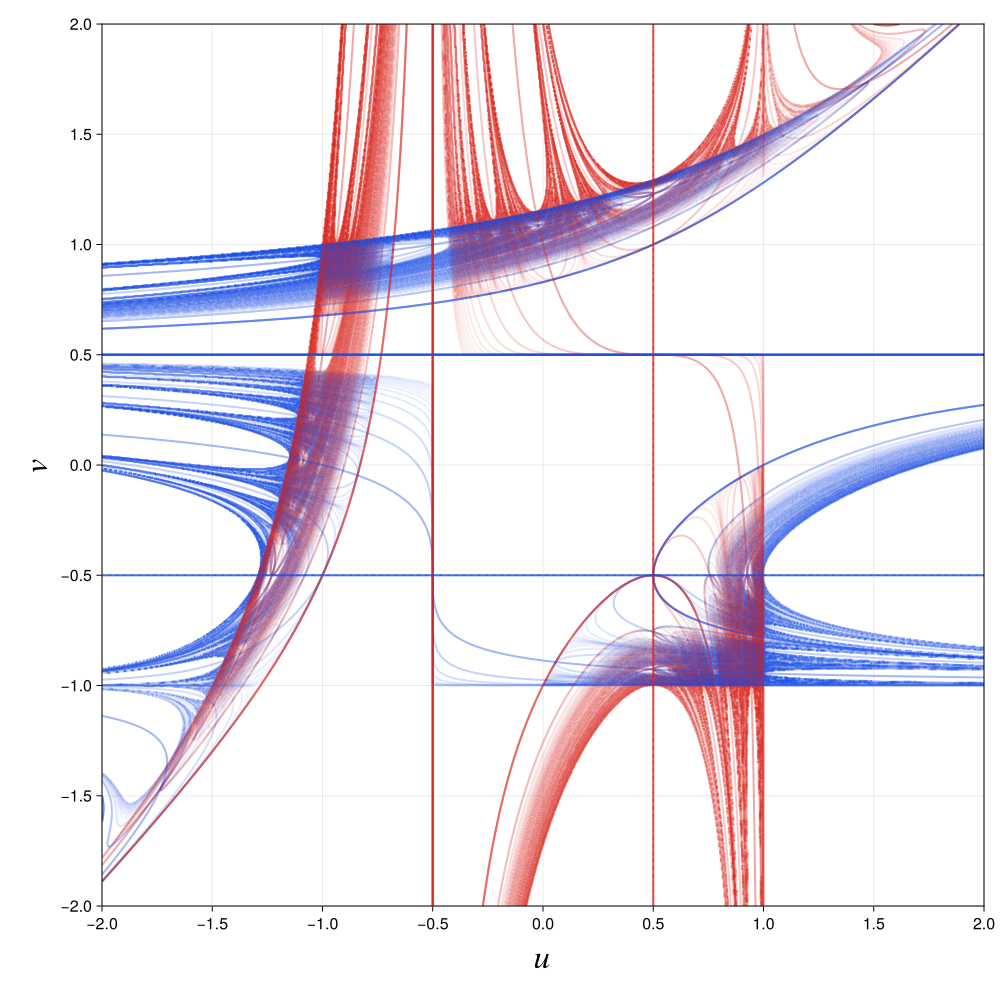

# [Calculate a Chebyshev cubic kneading diagram](@id chebyshev-cubic-tutorial)

This tutorial calculates a kneading diagram for the two-parameter Chebyshev
cubic family. It follows both critical orbits, records where an orbit crosses
either critical point, extracts those critical-relation curves, and renders
the result.

## The map family

The family is

```math
f_{u,v}(x)
=
\frac{u-v}{2}\left(4x^3-3x\right)
+
\frac{u+v}{2}.
```

Its critical points are

```math
c_-=-\frac{1}{2}, \qquad c_+=\frac{1}{2},
```

and the parameters are their critical values:

```math
f_{u,v}(c_-)=u, \qquad f_{u,v}(c_+)=v.
```

Explore the family interactively in the
[Chebyshev cubic Desmos calculator](https://www.desmos.com/calculator/vb6a1fp6ex).

A contour in this tutorial marks parameters where an entry in a critical
orbit equals ``c_-`` or ``c_+``. These are critical-relation curves of the
form

```math
f_{u,v}^{n}(c_s)=c_t,
\qquad s,t\in\{-,+\}.
```

## Define the family and parameter plane

First define the map and a rectangular grid in ``(u,v)``. A `101 x 101` grid
keeps this documentation build quick. The complete example uses `1000 x 1000`.

```@example chebyshev-cubic
using Kneading.Diagrams

@inline function chebyshev_cubic(u, v, x)
    return ((u - v) / 2) * (4x^3 - 3x) + (u + v) / 2
end

grid_size = 101
parameter_values = collect(range(-2.0, 2.0; length = grid_size))
plane = ParameterPlane(
    parameter_values,
    parameter_values;
    xname = "𝑢",
    yname = "𝑣",
)
```

The first array dimension corresponds to `v`, the vertical axis, and the
second corresponds to `u`, the horizontal axis.

## Initialize the critical orbits

Create the diagram and two scalar fields. The fields initially contain the
left and right critical points at every parameter pair.

```@example chebyshev-cubic
critical_points = (-0.5, 0.5)
iterates = 8

diagram = KneadingDiagram(
    plane;
    metadata = (
        family = :chebyshev_cubic,
        critical_points = critical_points,
        iterates = iterates,
    ),
)

orbit_values = Array{Float64}(undef, grid_size, grid_size, 2)
orbit_values[:, :, 1] .= critical_points[1]
orbit_values[:, :, 2] .= critical_points[2]

diagram.metadata
```

## Advance and contour the orbits

At each step, `scan_plane!` advances both critical orbits at every parameter
pair. For each orbit, `add_level_contours!` extracts one contour at each
critical point.

```@example chebyshev-cubic
for iterate in 2:iterates
    scan_plane!(orbit_values, plane) do values, u, v
        values[1] = chebyshev_cubic(u, v, values[1])
        values[2] = chebyshev_cubic(u, v, values[2])
    end

    for (source_index, source) in enumerate((:left_critical, :right_critical))
        field = view(orbit_values, :, :, source_index)
        for level in critical_points
            add_level_contours!(
                diagram,
                field;
                source = source,
                iterate = iterate,
                level = level,
            )
        end
    end
end

(
    layers = length(diagram.layers),
    nonempty_layers = count(layer -> !isempty(layer.segments), diagram.layers),
    segments = sum(length(layer.segments) for layer in diagram.layers),
)
```

The stored critical point is orbit entry 1. One map application produces
entry 2, so `ContourLayer.iterate` uses one-based orbit-entry numbers. A layer
labeled `iterate = 2` therefore represents ``f(c_s)=c_t``.

## Threading behavior

The tutorial is partly multithreaded. `scan_plane!` uses `Threads.@threads`
across the parameter plane's `u` columns. Each loop task advances both critical
orbits for every `v` value in its current column. Every callback writes only to
its own `orbit_values[v_index, u_index, :]` slice, so these updates do not share
mutable output locations.

Julia must start with more than one thread for this stage to run in parallel.
Use `--threads=auto` to let Julia select the thread count:

```bash
julia --threads=auto --project=examples \
    examples/chebyshev_cubic_kneading.jl
```

Check the active thread count inside Julia with:

```julia
Threads.nthreads()
```

The outer loop over orbit entries remains sequential. Entry ``n+1`` depends
on entry ``n``, and `scan_plane!` waits for all parameter columns to finish
before the next entry begins. After each orbit update, the four calls to
`add_level_contours!` run sequentially. Their marching-squares work in
`level_contours` is currently serial, as is the final CairoMakie rendering.

Consequently, additional threads accelerate only the critical-orbit updates;
they do not parallelize contour extraction or plotting. The tutorial code and
`chebyshev_cubic_kneading.jl` use this threaded `scan_plane!` path. The
reusable calculation in `chebyshev_cubic_scan.jl` currently advances the
parameter grid with explicit serial loops.

## Render the diagram

Load CairoMakie to activate the plotting extension. Red curves come from the
left critical orbit and blue curves come from the right critical orbit. Older
orbit entries are drawn more strongly, while later entries fade according to
the opacity function.

```julia
using CairoMakie

colors = Dict(
    :left_critical => RGBf(0.85, 0.15, 0.12),
    :right_critical => RGBf(0.10, 0.30, 0.90),
)

save_kneading_contours(
    "chebyshev_cubic_kneading_diagram.png",
    diagram;
    colors = colors,
    opacity = iterate -> Float64(iterate - 1)^(-1.2),
    xticks = -2.0:0.5:2.0,
    yticks = -2.0:0.5:2.0,
)
```

The full `1000 x 1000`, 20-entry calculation produces:



Every orbit entry adds four layers: two source critical points times two
target critical points. With entries 2 through 20, the full diagram therefore
contains 76 contour layers.

## Run the complete example

The repository contains the complete plotting script and a dependency-free
calculation used by its tests:

- [`chebyshev_cubic_kneading.jl`](https://github.com/hinsley/Kneading.jl/blob/main/examples/chebyshev_cubic_kneading.jl)
  calculates and saves the full figure.
- [`chebyshev_cubic_scan.jl`](https://github.com/hinsley/Kneading.jl/blob/main/examples/chebyshev_cubic_scan.jl)
  exposes the calculation as a reusable example module.

From the repository root, install the example environment and run the full
plot:

```bash
julia --project=examples -e 'using Pkg; Pkg.instantiate()'
julia --project=examples examples/chebyshev_cubic_kneading.jl
```

For a quicker preview, reduce the grid and number of orbit entries:

```bash
CHEBYSHEV_GRID_SIZE=200 CHEBYSHEV_ITERATES=8 \
    julia --project=examples examples/chebyshev_cubic_kneading.jl
```
