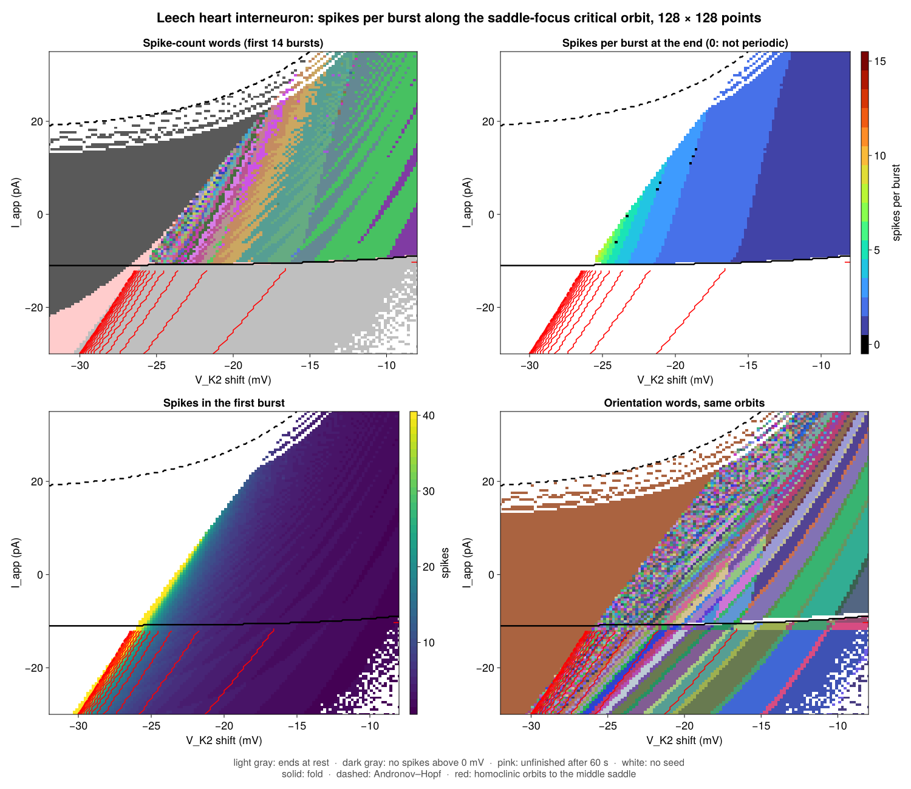

# Kneading diagram examples

`Kneading.Diagrams` exports `ParameterPlane`, `scan_plane!`,
`level_contours`, `add_level_contours!`, and `KneadingDiagram`. Loading
CairoMakie activates `plot_kneading_contours` and
`save_kneading_contours`.

`chebyshev_cubic_kneading.jl` uses the public package APIs to scan the two
critical orbits of

$$
f_{u,v}(x)
=
\frac{u-v}{2}\left(4x^3-3x\right)
+
\frac{u+v}{2}.
$$

The critical points are $-1/2$ and $1/2$. The example draws a contour whenever
an iterate of either critical point crosses either critical point. Red curves
come from the left critical orbit. Blue curves come from the right critical
orbit.

The same package API accepts scalar fields produced by other computations. The
scan and plotting code does not depend on the Chebyshev family.

Install the plotting dependency:

```bash
julia --project=examples -e 'using Pkg; Pkg.instantiate()'
```

Generate the full `1000 x 1000`, 20-iterate diagram:

```bash
julia --project=examples examples/chebyshev_cubic_kneading.jl
```

Run a smaller scan:

```bash
CHEBYSHEV_GRID_SIZE=200 CHEBYSHEV_ITERATES=8 \
    julia --project=examples examples/chebyshev_cubic_kneading.jl
```

Run the dependency-free example tests from the repository root:

```bash
julia --project=. examples/test_chebyshev_cubic_kneading.jl
```

## Rössler flow kneading

`rossler_kneading_diagram.jl` uses the public saddle-focus initializer and
flow-kneading scan API for the origin-fixed Rössler system. From the repository
root, run:

```sh
julia --project=. --threads=auto examples/rossler_kneading_diagram.jl
julia --project=examples examples/plot_rossler_kneading.jl output/rossler-flow-kneading.tsv
```

The default grid is 256 by 256. Set `ROSSLER_RESOLUTION=32` for a quick trial
and `ROSSLER_OUTPUT` to choose the TSV destination. Plotting uses the optional
environment installed above and writes raw-sign and transition-word images
under `output/figures/`, leaving incomplete words white.

The example reproduces the reference protocol: fixed event index 4, RK4 step
0.05, and eight raw signs including the initial critical event. New calculations
can instead use adaptive integration and automatic seed refinement, as shown in
the [flow-kneading guide](../docs/src/flow-kneading.md).

Run the checked-in reference fixtures independently with:

```sh
julia --project=. examples/verify_rossler_reference.jl
```

## Leech heart interneuron flow kneading

`leech_heart_interneuron_kneading.jl` scans the reduced leech heart
interneuron model of Channell, Cymbalyuk and Shilnikov,
[PRL 98, 134101 (2007)](https://doi.org/10.1103/PhysRevLett.98.134101), with an
applied current $I_\mathrm{app}$ (nA) added to the voltage equation:

$$
\begin{aligned}
0.5\,\dot V &= I_\mathrm{app} - 200 f(-150, 0.0305, V)^3 h (V - 0.045)
  - 30 m^2 (V + 0.07) - 8 (V + 0.046),\\
\dot h &= 24.69 \left(f(500, 0.0333, V) - h\right),\\
\dot m &= 4 \left(f(-83, 0.018 + V_{K2}^\mathrm{shift}, V) - m\right),
\end{aligned}
$$

with $f(a, b, V) = 1/(1 + e^{a(b + V)})$, $V$ in volts and time in seconds.
At $I_\mathrm{app} = 0$ it reproduces the published bursts with three spikes at
$V_{K2}^\mathrm{shift} = -0.021$, two at $-0.016$, and tonic spiking at $-0.012$.

The plane is $(V_{K2}^\mathrm{shift}, I_\mathrm{app})$. The shift drives the
spike-adding cascade of the paper; the current moves the equilibria through a
fold (three equilibria below about $-10$ pA) and an Andronov–Hopf bifurcation of
the depolarized equilibrium. Both curves come from classifying the equilibria on
a finer grid. Two orbits are followed at every point, with events at minima of $m$:

- The unstable manifold of the depolarized saddle-focus (two unstable
  eigenvalues), from `SaddleFocusInitializer` continued across the plane, with a
  fresh start where continuation fails. Its words change across homoclinic
  bifurcations of the **saddle periodic orbit** that separates spiking from
  quiescence: these are the spike-adding bands of the word map. They involve no
  equilibrium, so return times to the equilibria do not show them.
- Below the fold, the separatrix of the middle real saddle (one unstable
  eigenvalue) toward spiking, from `RealSaddleInitializer`. It spikes and then
  rests, so its word ends at rest. The number of events before rest forms a
  staircase whose steps are **homoclinic orbits to the saddle equilibrium**: at a
  step the separatrix lands on the saddle's stable manifold (checked by bisection,
  where the closest return to the saddle shrinks toward zero). The figures draw
  these steps as red contours. Near the fold the orbit passes slowly through the
  ghost of the saddle-node and picks up one more $m$ minimum that is not a spike
  (a nullcline tangency); the plot does not count an event that follows a gap
  of more than 2 s, and leaves the two pixel rows next to the fold out of the
  contours.

The colors are the transition words of the critical orbit on the saddle-focus
unstable manifold; words that end at rest below the fold are colored too. The
period of the word tail gives the number of spikes per burst. In the
tonic-spiking region (shift above about $-14$ mV, period one) the bands differ
only in the transient part of the word, before the orbit settles on tonic
spiking. White
means no word: above the Andronov–Hopf curve the depolarized equilibrium is
stable and there is no saddle-focus to seed from, and the remaining white pixels
are critical points that neither continuation nor a fresh start found, or words
still incomplete after 200 s. `leech_heart_interneuron_traces.jl` simulates the
marked points A–E (small oscillations, bursts of three and two spikes, tonic
spiking, and the separatrix that rests after two spikes) for the slide figure.

Run a small scan on the CPU, then plot:

```sh
LEECH_RESOLUTION=16 julia --project=. examples/leech_heart_interneuron_kneading.jl
julia --project=. examples/leech_heart_interneuron_traces.jl
julia --project=examples examples/plot_leech_heart_interneuron.jl output/leech-heart-interneuron
```

`LEECH_SHIFT` and `LEECH_CURRENT` set the ranges, for example
`LEECH_SHIFT=-0.032,-0.008` and `LEECH_CURRENT=-0.03,0.035`. On a GPU, call
`main(backend = CUDABackend())` after `using CUDA`.
`leech_heart_interneuron_kaggle.py` packages the package source and this
script as a private Kaggle kernel for a T4:

```sh
python3 examples/leech_heart_interneuron_kaggle.py <user> leech-scan \
    --env LEECH_RESOLUTION=128 LEECH_SHIFT=-0.032,-0.008 LEECH_CURRENT=-0.03,0.035
kaggle kernels push -p output/kaggle
```


### Spikes per burst

`leech_heart_interneuron_spike_counts.jl` reads the critical orbits of the
saddle-focus scan (the seed states in `orbits.tsv`) and codes each orbit by its
spikes per burst instead of orientation. A spike is a maximum of $V$ above 0 mV
(the counts do not change between −5 and 0 mV, while small oscillations peak
below −9 mV and late spikes in long bursts can peak below +20 mV); a burst ends
when the next spike is more than 0.4 s away (0.3 and 0.5 s give the same
counts). The word is the first 14 counts, from fixed-step RK4 with a 0.1 ms
step. Minima of $m$ are not used to split bursts, because $m$ has a minimum
after every spike.

```sh
julia --project=. examples/leech_heart_interneuron_spike_counts.jl
julia --project=examples examples/plot_leech_heart_interneuron_spike_counts.jl output/leech-heart-interneuron
```

The figure uses the 13,241 critical orbits that came from continuation in the
128 × 128 scan; the 1,031 points seeded by fresh starts did not store their
seeds and are white. Of the counted orbits, 5,704 give 14 complete counts,
3,897 end at rest, 3,144 never spike above 0 mV, and 496 are unfinished after
60 s.

Compared with the orientation words of the same orbits, over neighbouring
pixel pairs where both codings give a word, 5,040 pairs differ in both, 3,852
only in the orientation word and 952 only in the counts.

- Spike adding is explicit in both and at the same places: along
  $I_\mathrm{app} = 0$ the final count and the period of the orientation word
  both change 5→4 at −22.6 mV, 4→3 at −21.8 mV and 3→2 at −19.9 mV.
- The period doubling from tonic spiking to two-spike bursts is seen only by
  the counts (2→1 between −15.0 and −14.8 mV, near the published −14.9 mV).
  At −15.2 and −15.0 mV the orbit alternates intervals of 0.28 and 0.84 s,
  but the orientation reverses at every event on both sides.
- Crease contours are seen only by the orientation words. At −11.78 mV between
  18.6 and 19.1 pA, and at −9.0 pA between −22.36 and −22.17 mV, the spike
  counts and the times of the $m$ minima are unchanged, while one orientation
  sign flips.
- Threshold contours are seen only by the counts. At 0.7 pA between −10.27
  and −10.08 mV, and at −19.25 pA between −21.42 and −21.23 mV, the growing
  oscillation that leaves the saddle-focus crosses 0 mV and becomes one more
  "spike" (69 → 70 and 4 → 5 spikes), with identical $m$ minima and orientation
  words. These contours move with the threshold.
- Where bursts become very long, the count of the first burst rises past 40
  spikes and the orbits are unfinished after 60 s; the orientation words show
  a speckled band before the uniform small-oscillation region. The irregular
  region is much narrower in the counts.


