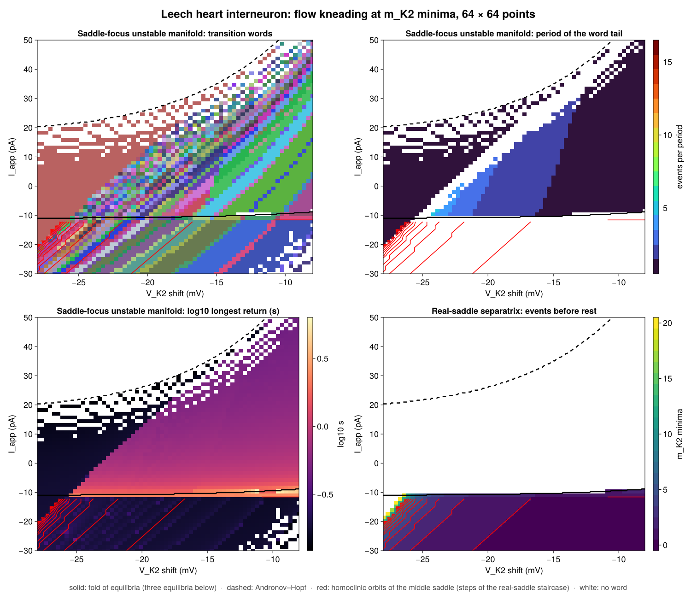
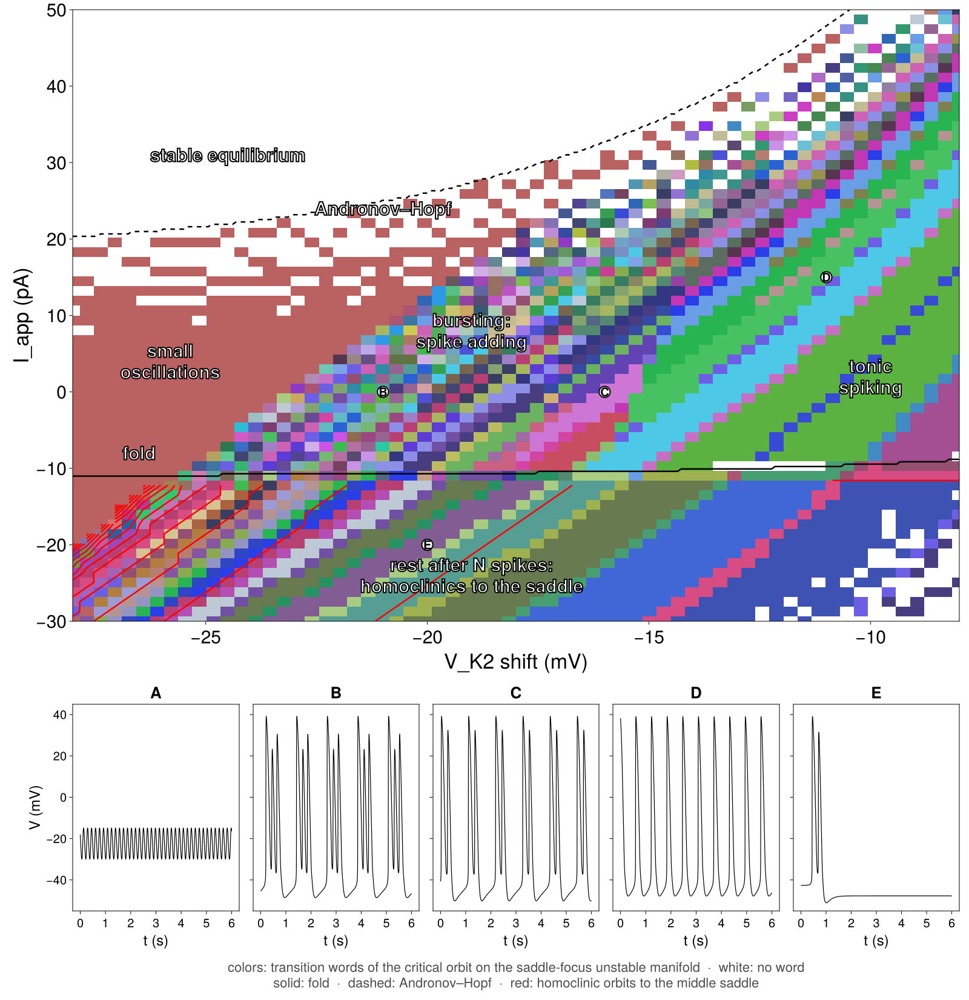

# Kneading diagram examples

`Kneading.Diagrams` exports `ParameterPlane`, `scan_plane!`,
`level_contours`, `add_level_contours!`, and `KneadingDiagram`. Loading
CairoMakie activates `plot_kneading_contours` and
`save_kneading_contours`.

`chebyshev_cubic_kneading.jl` uses the public package APIs to scan the two
critical orbits of

$$
f_{u,v}(x)
=
\frac{u-v}{2}\left(4x^3-3x\right)
+
\frac{u+v}{2}.
$$

The critical points are $-1/2$ and $1/2$. The example draws a contour whenever
an iterate of either critical point crosses either critical point. Red curves
come from the left critical orbit. Blue curves come from the right critical
orbit.

The same package API accepts scalar fields produced by other computations. The
scan and plotting code does not depend on the Chebyshev family.

Install the plotting dependency:

```bash
julia --project=examples -e 'using Pkg; Pkg.instantiate()'
```

Generate the full `1000 x 1000`, 20-iterate diagram:

```bash
julia --project=examples examples/chebyshev_cubic_kneading.jl
```

Run a smaller scan:

```bash
CHEBYSHEV_GRID_SIZE=200 CHEBYSHEV_ITERATES=8 \
    julia --project=examples examples/chebyshev_cubic_kneading.jl
```

Run the dependency-free example tests from the repository root:

```bash
julia --project=. examples/test_chebyshev_cubic_kneading.jl
```

## Rössler flow kneading

`rossler_kneading_diagram.jl` uses the public saddle-focus initializer and
flow-kneading scan API for the origin-fixed Rössler system. From the repository
root, run:

```sh
julia --project=. --threads=auto examples/rossler_kneading_diagram.jl
julia --project=examples examples/plot_rossler_kneading.jl output/rossler-flow-kneading.tsv
```

The default grid is 256 by 256. Set `ROSSLER_RESOLUTION=32` for a quick trial
and `ROSSLER_OUTPUT` to choose the TSV destination. Plotting uses the optional
environment installed above and writes raw-sign and transition-word images
under `output/figures/`, leaving incomplete words white.

The example reproduces the reference protocol: fixed event index 4, RK4 step
0.05, and eight raw signs including the initial critical event. New calculations
can instead use adaptive integration and automatic seed refinement, as shown in
the [flow-kneading guide](../docs/src/flow-kneading.md).

Run the checked-in reference fixtures independently with:

```sh
julia --project=. examples/verify_rossler_reference.jl
```

## Leech heart interneuron flow kneading

`leech_heart_interneuron_kneading.jl` scans the reduced leech heart
interneuron model of Channell, Cymbalyuk and Shilnikov,
[PRL 98, 134101 (2007)](https://doi.org/10.1103/PhysRevLett.98.134101), with an
applied current $I_\mathrm{app}$ (nA) added to the voltage equation:

$$
\begin{aligned}
0.5\,\dot V &= I_\mathrm{app} - 200 f(-150, 0.0305, V)^3 h (V - 0.045)
  - 30 m^2 (V + 0.07) - 8 (V + 0.046),\\
\dot h &= 24.69 \left(f(500, 0.0333, V) - h\right),\\
\dot m &= 4 \left(f(-83, 0.018 + V_{K2}^\mathrm{shift}, V) - m\right),
\end{aligned}
$$

with $f(a, b, V) = 1/(1 + e^{a(b + V)})$, $V$ in volts and time in seconds.
At $I_\mathrm{app} = 0$ it reproduces the published bursts with three spikes at
$V_{K2}^\mathrm{shift} = -0.021$, two at $-0.016$, and tonic spiking at $-0.012$.

The plane is $(V_{K2}^\mathrm{shift}, I_\mathrm{app})$. The shift drives the
spike-adding cascade of the paper; the current moves the equilibria through a
fold (three equilibria below about $-10$ pA) and an Andronov–Hopf bifurcation of
the depolarized equilibrium. Both curves come from classifying the equilibria on
a finer grid. Two orbits are followed at every point, with events at minima of $m$:

- The unstable manifold of the depolarized saddle-focus (two unstable
  eigenvalues), from `SaddleFocusInitializer` continued across the plane, with a
  fresh start where continuation fails. Its words change across homoclinic
  bifurcations of the **saddle periodic orbit** that separates spiking from
  quiescence: these are the spike-adding bands of the word map. They involve no
  equilibrium, so return times to the equilibria do not show them.
- Below the fold, the separatrix of the middle real saddle (one unstable
  eigenvalue) toward spiking, from `RealSaddleInitializer`. It spikes and then
  rests, so its word ends at rest. The number of events before rest forms a
  staircase whose steps are **homoclinic orbits to the saddle equilibrium**: at a
  step the separatrix lands on the saddle's stable manifold (checked by bisection,
  where the closest return to the saddle shrinks toward zero). The figures draw
  these steps as red contours. Steps accumulate on the fold, so the pixel row
  next to the fold is left out of the contours.

The colors are the transition words of the critical orbit on the saddle-focus
unstable manifold; words that end at rest below the fold are colored too. White
means no word: above the Andronov–Hopf curve the depolarized equilibrium is
stable and there is no saddle-focus to seed from, and the remaining white pixels
are critical points that neither continuation nor a fresh start found, or words
still incomplete after 200 s. `leech_heart_interneuron_traces.jl` simulates the
marked points A–E (small oscillations, bursts of three and two spikes, tonic
spiking, and the separatrix that rests after two spikes) for the slide figure.

Run a small scan on the CPU, then plot:

```sh
LEECH_RESOLUTION=16 julia --project=. examples/leech_heart_interneuron_kneading.jl
julia --project=. examples/leech_heart_interneuron_traces.jl
julia --project=examples examples/plot_leech_heart_interneuron.jl output/leech-heart-interneuron
```

`LEECH_SHIFT` and `LEECH_CURRENT` set the ranges, for example
`LEECH_SHIFT=-0.032,-0.008` and `LEECH_CURRENT=-0.03,0.035`. On a GPU, call
`main(backend = CUDABackend())` after `using CUDA`.
`leech_heart_interneuron_kaggle.py` packages the package source and this
script as a private Kaggle kernel for a T4:

```sh
python3 examples/leech_heart_interneuron_kaggle.py <user> leech-scan \
    --env LEECH_RESOLUTION=128 LEECH_SHIFT=-0.032,-0.008 LEECH_CURRENT=-0.03,0.035
kaggle kernels push -p output/kaggle
```




